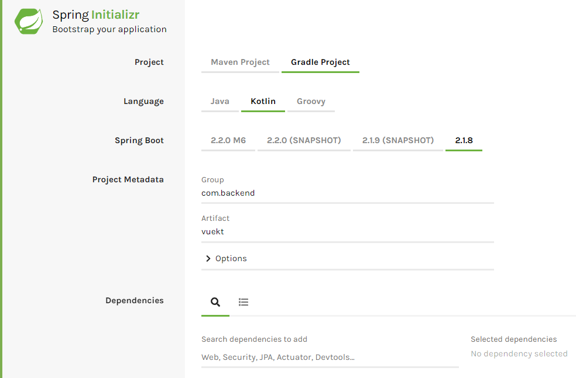
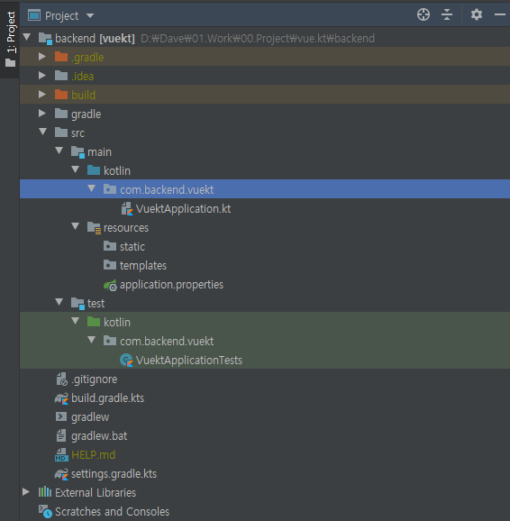

# 개요
이 포스팅에서는 [Kotlin](https://kotlinlang.org/) 언어와 [Spring Boot](https://spring.io/projects/spring-boot) 프레임워크로 REST Api 서비스를 구축하는 과정을 담고자 합니다.

만약 Kotlin에 대해 자세히 알고 싶으시면 [참고 문서](https://kotlinlang.org/docs/reference/)를 읽어보시고, [웹 튜토리얼](https://play.kotlinlang.org/koans/overview)을 통해 쉽게 배우실 수 있습니다.

# 목표
새로운 기술을 재미있게 공부하기 위해서는 **토이 프로젝트**가 제격이라고 봅니다.  
이번 토이 프로젝트는 **[Vue.kt](https://github.com/luckyDaveKim/vue.kt)**로써 Front-end는 **Vue.js**를 사용하고, Back-end는 **Kotlin**을 사용하여 처음 시작하는 사람도 쉽게 접근할 수 있는 **Web Service Starter** Todo List를 만들어 보려고 합니다.

그 중 이번 포스팅에서는 Kotlin과 Spring Boot로 Back-end REST Api 서버를 구축하는 기본 과정을 그려보려 합니다.

> 이번 포스팅에서 진행하는 모든 과정은 **[Vue.kt](https://github.com/luckyDaveKim/vue.kt)** github에 담아두었습니다.

# 구성
다음과 같은 기술들을 사용합니다.
- Kotlin
- Spring boot
- Gradle
- JUnit5
- H2
- JPA

# 프로젝트 생성
Spring 사이트에서 Spring Frameworks를 구성을 도와주는 웹 페이지 [Spring Initializr](https://start.spring.io/)를 통해서 기본적인 Spring Boot 프로젝트를 생성하도록 하겠습니다.  
웹 페이지에 접속 후, Build Tool로 **Gradle**을 선택하고, 개발 언어로 **Kotlin**을 선택, 프로젝트 group명과 artifact를 입력하면 손쉽게 Spring Boot 프로젝트를 생성 할 수 있습니다.  
Dependencies 같은 경우 추후에 필요 시 추가할 수 있기 때문에 지금은 아무것도 입력하지 않았습니다.



이렇게 생성된 프로젝트 압축 파일을 원하는 경로에 풀고 각자의 개발 IDE로 실행하면 기본적인 준비는 끝났습니다. 저는 **[IntelliJ](https://www.jetbrains.com/idea/)**를 통해 개발하도록 하겠습니다.  
IntelliJ로 프로젝트를 열어보면, Spring Boot는 다음과 같은 구조를 갖고 있습니다.



간단하게 살펴보시면, 최상위에 src로 source root가 위치하고 있으며, 그 내부에 *main*과 *test*가 있습니다.  
*main*에는 핵심 source가 들어갈 예정이며, Spring Initializr에서 입력한 프로젝트 group명과 artifact로 패키지가 생성되어 있습니다.  
기본 패키지 아래를 보시면, *artifact명 + Application.kt*로 메인 클래스가 위치하고 있습니다.  
또한, main 아래에 *resources*는 정적인 파일들이 관리될 예정입니다.

여기까지 간단하게 Spring Boot의 기본 구조를 살펴보았습니다.  
이제 본격적으로 Spring Boot를 활용해 보도록 하겠습니다.

# Hello Todo 출력하기
프로젝트도 생성 했겠다. 기본적인 "Hello Todo"를 프린트하지 않고 넘어갈 수 없겠죠?

## Api 생성
기본적인 Todo API를 만들어 보겠습니다.  
`com.backend.vuekt.todo.api` 패키지에 `TodoApi.kt` 클래스를 생성하였습니다.

```java
package com.backend.vuekt.todo.api

import org.springframework.web.bind.annotation.GetMapping
import org.springframework.web.bind.annotation.RequestMapping
import org.springframework.web.bind.annotation.RestController

@RestController <=== (1)
@RequestMapping("/api/v1") <=== (2)
class TodoApi {

    @GetMapping("/") <=== (3)
    fun readTodo(): String { <=== (4)
        return "Hello Todo"
    }

}
```

- (1) : class 상단에 `@RestController` Annotation을 선언하였습니다.  
`@RestController`는 `@Controller`, `@ResponseBody`를 한번에 선언해주는 Annotation으로 해당 class의 모든 하위 함수에 `@ResponseBody`를 명시적으로 붙여주지 않아도 자동으로 설정해준다.
- (2) : calss 상단에 `@RequestMapping`를 선언하여 해당 class의 모든 하위 함수 Url Mapping값 앞에 */api/v1*을 적용하였습니다.
- (3) : 함수 상단에 `@GetMapping`을 선언하여 *get*으로 접근하는 request를 매핑하도록 하였습니다.
- (4) : *readTodo*라는 함수를 선언하고 requset요청 시 *Hello Todo*를 반환하도록 하였습니다.

프로젝트를 빌드 및 실행 후, *localhost:8080/api/v1/*로 get request를 날리면 *Hello Todo*가 출력되는 것을 확인할 수 있습니다.

## Unit Test
생성한 Api를 테스트하는 간단한 unit test를 작성해 보겠습니다.

### JUnit5 Dependencies 설정
테스트를 작성하기에 앞서 의존성 모듈을 설정하도록 하겠습니다.  
`build.gradle.kts` gradle 설정 파일에 다음과 같이 dependencies를 변경해 줍니다.

#### As-Is
```yaml
dependencies {
	implementation("org.springframework.boot:spring-boot-starter-web")
	implementation("com.fasterxml.jackson.module:jackson-module-kotlin")
	implementation("org.jetbrains.kotlin:kotlin-reflect")
	implementation("org.jetbrains.kotlin:kotlin-stdlib-jdk8")
	testImplementation("org.springframework.boot:spring-boot-starter-test")
}
```

#### To-Be
```yaml
dependencies {
	implementation("org.springframework.boot:spring-boot-starter-web")
	implementation("com.fasterxml.jackson.module:jackson-module-kotlin")
	implementation("org.jetbrains.kotlin:kotlin-reflect")
	implementation("org.jetbrains.kotlin:kotlin-stdlib-jdk8")
	testCompile("org.springframework.boot:spring-boot-starter-test") {
		exclude(module = "junit") <=== (1)
	}
	testImplementation("org.junit.jupiter:junit-jupiter-api") <=== (2)
	testRuntimeOnly("org.junit.jupiter:junit-jupiter-engine") <=== (3)
}
```

- (1) : `org.springframework.boot:spring-boot-starter-test` 모듈은 `JUnit4`에 대한 의존성을 가지고 있습니다.  
그래서 `JUnit5`를 사용하기 위해서는 `org.springframework.boot:spring-boot-starter-test`에 추가되어 있는 `JUnit4`를 제외해야 합니다.
- (2) : `org.junit.jupiter:junit-jupiter-api` 모듈은 테스트 코드 작성에 사용되는 모듈입니다.
- (3) : `org.junit.jupiter:junit-jupiter-engine` 모듈은 테스트 실행에 사용되는 모듈입니다.

그리고 추가로 `useJUnitPlatform`을 선언합니다.

```yaml
tasks.withType<Test> {
	useJUnitPlatform() <=== (1)
}
```

- (1) : `useJUnitPlatform()`은 테스트 실행시 JUnit 플랫폼이라는 것을 명시합니다.

### Unit Test 작성
의존성 모듈을 모두 설정하였으니 이제 본격적으로 unit test를 작성하도록 하겠습니다.

`com.backend.vuekt.todo.api.todoapi` 패키지에 `ReadTodoTests.kt` 클래스를 생성하였습니다.

```java
package com.backend.vuekt.todo.api.todoapi

import com.backend.vuekt.todo.api.TodoApi
import org.junit.jupiter.api.Test
import org.springframework.beans.factory.annotation.Autowired
import org.springframework.boot.test.autoconfigure.web.servlet.WebMvcTest
import org.springframework.test.web.servlet.MockMvc
import org.springframework.test.web.servlet.request.MockMvcRequestBuilders.get
import org.springframework.test.web.servlet.result.MockMvcResultMatchers.content
import org.springframework.test.web.servlet.result.MockMvcResultMatchers.status

@WebMvcTest(TodoApi::class) <=== (1)
class ReadTodoTests(@Autowired val mockMvc: MockMvc) { <=== (2)

    @Test
    fun `Assert get right contents`() {
        /* when */
        val actions = mockMvc.perform(get("/api/v1/")) <=== (3)

        /* then */
        actions.andExpect(status().isOk)
                .andExpect(content().string("Hello Todo")) <=== (4)
    }

}
```

- (1) : `@WebMvcTest`은 MVC를 위한 단위 테스트 annotation으로 `@SpringBootTest`보다 가볍습니다.
그렇기 때문에 테스트할 특정 클래스를 명시 해야합니다.
- (2) : 주입된 `MockMvc`는 테스트시, 모든 의존성을 로드하는 것이 아닌 `@WebMvcTest`에 설정한 클래스와 관련된 Bean만 로드합니다.
- (3) : *Given/When/Then* 테스트 패턴(DBB:Behavior-Driven-Development)중 `When`으로 테스트의 행위를 기술합니다.
- (4) : `Then`은 테스트의 결과를 검증합니다.

# 줄이며...
지금까지 Kotlin-Spring Boot 프로젝트 생성부터 간단한 REST Api 작성 및 테스트를 진행하였습니다.  
다음에는 DB 연결을 진행하도록 하겠습니다.
