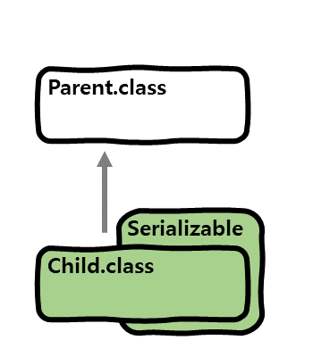
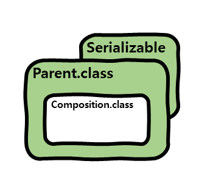

# 개요
이 포스팅에서는 Java 객체의 직렬화(Serialization)와 직렬화된 정보를 Java 객체로 만드는 역 직렬화(Deserialization)에 대해 알아보겠습니다.

# 자바 직렬화, 역 직렬화란?
우리는 살면서 중요한 정보를 잊지 않기 위해 메모를 합니다. 이처럼 자바의 객체를 비휘발성 메모리에 저장했다가 꺼내 쓸 수 있고,
프로그램을 재시작한 후에도 저장된 객체 정보를 불러올 수 있다면 어떨까요? 이를 가능하게 하는 것이 **직렬화**, **역 직렬화**입니다.

자바 **직렬화**는 객체를 스트림을 통해 연속적(serial)인 데이터로 변환하고, 다시 데이터를 객체로 **역 직렬화** 할 수 있습니다. 
직렬화를 활용하면 단순히 객체를 저장 및 복원하는 것이 아니라, 다양한 자바 서비스 간 객체 정보를 유기적으로 공유할 수도 있습니다.

# 자바 직렬화 사용방법
자바의 직렬화는 `ObjectOutputStream.writeObject(Object o)` 메소드를 사용하여 객체를 직렬화할 수 있으며,
직렬화 대상 객체는 **직렬화 가능한 클래스**의 인스턴스여야 합니다.  
이러한 **직렬화 가능한 클래스**가 되는 방법은 두 가지가 있습니다.
* `Serializable` 인터페이스를 구현(implements)한다.
* 직렬화 가능한 클래스를 상속한다.

## Serializable 인터페이스
`Serializable` 인터페이스는 구현해야 하는 메소드가 없는, 객체 직렬화를 명시하는 용도의 마크 인터페이스입니다.
다음은 `Serializable` 인터페이스를 통해 어떤 식으로 직렬화를 수행하는지 알아보겠습니다.

```java
public class ObjectOutputStream extends OutputStream implements ObjectOutput, ObjectStreamConstants {

  // ...

  private void writeObject0(Object obj, boolean unshared) throws IOException {
    // ...
    
    if (obj instanceof String) {
      writeString((String) obj, unshared);
    } else if (cl.isArray()) {
      writeArray(obj, desc, unshared);
    } else if (obj instanceof Enum) {
      writeEnum((Enum<?>) obj, desc, unshared);
    } else if (obj instanceof Serializable) {
      writeOrdinaryObject(obj, desc, unshared);
    } else {
      if (extendedDebugInfo) {
        throw new NotSerializableException(cl.getName() + "\n" + debugInfoStack.toString());
      } else {
        throw new NotSerializableException(cl.getName());
      }
    }
    
    // ...
  }
  
}
```

`ObjectOutputStream` 클래스의 private 메소드인 `writeObject0()` 내부에서 `String`, `Array`, `Enum`, `Serializable` 이외의
객체의 경우에는 `NotSerializableException` 예외를 던지는 것을 볼 수 있습니다.

다시 자바 직렬화 사용방법으로 돌아와서, 직렬화를 통해 객체를 byte로 변환하는 예를 살펴보겠습니다.

```java
public class User implements Serializable {

  private final String name;
  private final int age;

  public User(String name, int age) {
    this.name = name;
    this.age = age;
  }

}
```

```java
public class Main {

  public static void main(String[] args) throws IOException, ClassNotFoundException {
    User user = new User("Dave", 30);

    /* 직렬화 */
    byte[] bytes = serialize(user);
  }

  /* 직렬화 메소드 */
  public static byte[] serialize(Object o) throws IOException {
    try (ByteArrayOutputStream baos = new ByteArrayOutputStream()) {
      try (ObjectOutputStream oos = new ObjectOutputStream(baos)) {
        oos.writeObject(o);
        return baos.toByteArray();
      }
    }
  }

}
```

1. 직렬화 가능한 클래스 :  
   `User` 객체를 **직렬화 가능한 클래스**로 만들기 위해 `Serializable` 인터페이스를 구현했습니다.
   
2. 직렬화 :  
   **객체 직렬화**는 `ObjectOutputStream` 클래스의 `writeObject()` 메소드를 통해 직렬화할 객체를 전달하고,
   `ByteArrayOutputStream` 클래스의 `toByteArray()` 메소드를 통해 객체를 직렬화한 byte 값을 얻습니다.

# 어디까지 직렬화가 될까?
자바의 직렬화를 하는 방법에 대해서 간단하게 알아보았습니다. 그렇다면 자바의 직렬화는 어디까지 가능할까요?  
다음 몇 가지 예시를 통해서 알아보도록 하겠습니다.
* 부모 클래스에 `Serializable` 구현
* 자식 클래스에 `Serializable` 구현
* **직렬화 가능한 클래스**가 직렬화 불가능한 객체를 맴버 변수로 참조

위 각각의 경우에 대해 직렬화 범위에 대해 알아보겠습니다.

## 부모 클래스에 `Serializable` 구현
부모 클래스가 `Serializable`을 구현하여, **직렬화 가능한 클래스**일 때 부모 클래스와 자식 클래스의 직렬화 가능성에 대해 알아보겠습니다.


```java
public class Parent implements Serializable {

  private final String name;

  public Parent(String name) {
    this.name = name;
  }
  
}

public class Child extends Parent {

  public Child(String name) {
    super(name);
  }

}
```

* `Parent` : 부모 클래스인 `Parent`는 `Serializable`을 구현하였기 때문에 직렬화가 가능합니다.
* `Child` : 자식 클래스인 `Child`는 **직렬화 가능한 클래스**인 `Parent` 클래스를 상속하였기 때문에 직렬화가 가능합니다.

## 자식 클래스에 `Serializable` 구현
부모 클래스는 **직렬화 가능한 클래스**가 아니며, 자식 클래스는 `Serializable`을 구현하여 **직렬화 가능한 클래스**일 때
부모 클래스와 자식 클래스의 직렬화 가능성에 대해 알아보겠습니다.



```java
public class Parent {

  private final String name;

  public Parent(String name) {
    this.name = name;
  }
  
}

public class Child extends Parent implements Serializable {

  public Child(String name) {
    super(name);
  }

}
```

* `Parent` : 부모 클래스인 `Parent`는 **직렬화 가능한 클래스**가 아니므로 직렬화가 불가능합니다.
* `Child` : 자식 클래스인 `Child`는 `Serializable`을 구현하였기 때문에 직렬화가 가능합니다.

## **직렬화 가능한 클래스**가 직렬화 불가능한 객체를 맴버 변수로 참조
**직렬화 가능한 클래스**가 직렬화 불가능한 객체를 맴버 변수로 참조하는 경우 해당 클래스의 직렬화 가능성에 대해 알아보겠습니다.



```java
public class Parent implements Serializable {

  private final String name;
  private final Composition composition;

  public Parent(String name, Composition composition) {
    this.name = name;
    this.composition = composition;
  }

}

public class Composition {

  private final String name;

  public Composition(String name) {
    this.name = name;
  }

}
```

위 경우에는 `Parent` 클래스가 **직렬화 가능한 클래스**이지만, 직렬화 불가능한 객체인 `Composition`을 맴버 변수로 참조하여
직렬화 시, `NotSerializableException` 예외가 발생합니다.
이를 해결하기 위해서는 두 가지 방법이 있습니다.
* `Composition` 클래스를 **직렬화 가능한 클래스**로 만든다.
* `Parent` 클래스에서 직렬화 불가능한 객체의 맴버 변수 `composition`에 `transient`를 붙여,
  `composition`을 직렬화 대상에서 명시적으로 제외한다.

다음은 `transient`을 사용한 예를 살펴보겠습니다.

```java
public class Parent implements Serializable {

  private final String name;
  private final transient Composition composition;

  public Parent(String name, Composition composition) {
    this.name = name;
    this.composition = composition;
  }

}

public class Composition {

  private final String name;

  public Composition(String name) {
    this.name = name;
  }

}
```

위와 같이 `Parent` 클래스 내부의 `composition` 맴버 변수에 `transient`를 붙이게 되면, `Parent` 객체를 직렬화 할 때,
`composition`을 제외하고 직렬화를 수행하여 `NotSerializableException` 예외가 발생하지 않습니다.

지금까지 자바의 직렬화에 대해 알아보았습니다.  
다음으로는 역 직렬화에 대해 알아보겠습니다.

# 자바 역 직렬화 사용방법
자바의 역 직렬화는 `ObjectInputStream.readObject()` 메소드를 사용하여 데이터를 객체로 역 직렬화할 수 있으며,

자바 객체를 직렬화하여 얻은 데이터를 가지고 다시 클래스로 만드는 역 직렬화를 할 수 있으며, 다음 두 가지 조건을 만족해야 합니다.
* 직렬화된 객체의 클래스가 Class Path에 존재해야 한다.
* 직렬화된 객체의 클래스가 import된 상태여야 한다.

다음은 직렬화로 얻은 byte를 가지고 다시 객체로 만드는 역 직렬화의 예를 살펴보겠습니다.

```java
public class User implements Serializable {

  private final String name;
  private final int age;

  public User(String name, int age) {
    this.name = name;
    this.age = age;
  }

}
```

```java
public class Main {

  public static void main(String[] args) throws IOException, ClassNotFoundException {
    User user = new User("Dave", 30);

    /* 직렬화 */
    byte[] bytes = serialize(user);
    
    /* 역 직렬화 */
    User newUser = (User) deserialize(bytes);
  }

  /* 직렬화 메소드 */
  public static byte[] serialize(Object o) throws IOException {
    try (ByteArrayOutputStream baos = new ByteArrayOutputStream()) {
      try (ObjectOutputStream oos = new ObjectOutputStream(baos)) {
        oos.writeObject(o);
        return baos.toByteArray();
      }
    }
  }

  /* 역 직렬화 메소드 */
  public static Object deserialize(byte[] bytes) throws IOException, ClassNotFoundException {
    try (ByteArrayInputStream bais = new ByteArrayInputStream(bytes)) {
      try (ObjectInputStream ois = new ObjectInputStream(bais)) {
        return ois.readObject();
      }
    }
  }

}
```

1. 역 직렬화 :  
   **객체 역 직렬화**는 `ByteArrayInputStream` 클래스에 직렬화된 byte 값을 전달하고, `ObjectInputStream` 클래스의 `readObject()` 메소드를
   통해 객체를 얻은 후, 명시적 형 변환을 통해 올바른 객체로 변환합니다.

지금까지 자바 직렬화와 역 직렬화에 대해 알아보았습니다. 예시에는 `ByteArrayOutStream`을 사용하여 객체를 byte 데이터로 변환하였으나,
`FileOutputStream` 등을 사용하여 다양한 종류의 데이터로 변환이 가능합니다.

# 줄이며...
자바의 직렬화를 사용하기 위해서는 `Serializable` 인터페이스를 구현해야 하며, 모든 맴버변수 또한 **직렬화 가능한 클래스**여야 합니다.

이어서 자바 직렬화의 `SerialVersionUID`에 대해 알아보겠습니다.
