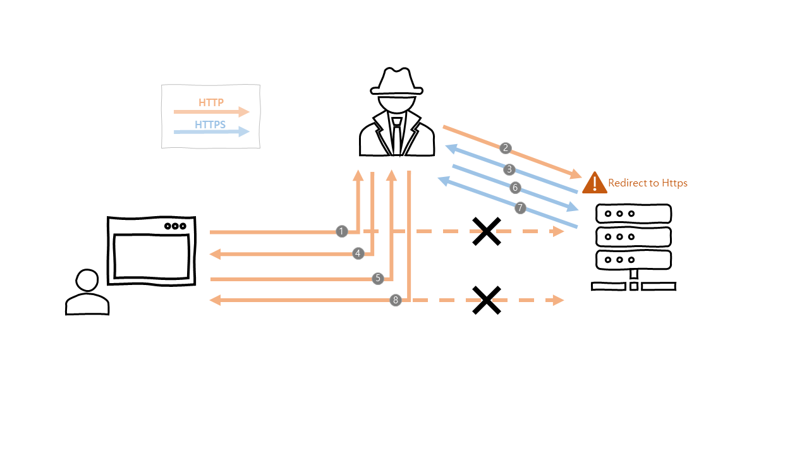
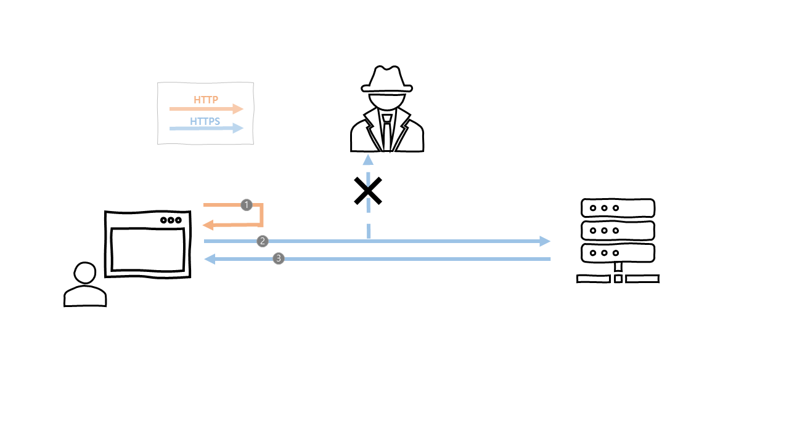
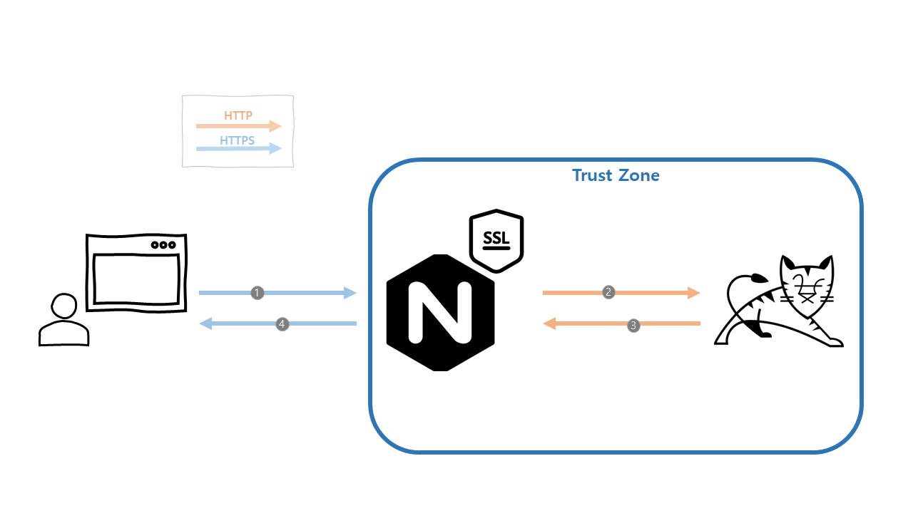

# 개요
 이 포스팅에서는 `HSTS`(HTTP Strict Transport Security)의 개념에 대해 알아보고,
[Nginx](https://www.nginx.com) + [Tomcat](http://tomcat.apache.org)의 환경에서
[Spring Security](https://spring.io/projects/spring-security)의 HSTS 설정중 겪은 이슈에 대해 공유하려 합니다.

# HSTS(HTTP Strict Transport Security)란 무엇인가?
 HSTS는 보안을 강화하기 위한 기술로, 웹 접속시 [HTTPS](https://ko.wikipedia.org/wiki/HTTPS)(HTTP over Secure Socket Layer) 프로토콜을 사용하도록 강제하는 기능입니다.  
브라우저의 요청에 대한 응답에 HSTS 헤더를 담아서 보내게 되면, 브라우저는 향후 일정 시간(max-age 옵션에 설정한 시간)동안 해당 도메인에 요청시 HTTPS 프로토콜을 사용하게 됩니다.  

> HSTS는 국제 인터넷 표준화 기구(IETF, Internet Engineering Task Force) 표준이며, [RFC-6797](https://tools.ietf.org/html/rfc6797)로 세부내용이 기술되어 있습니다.

# HSTS의 장점은 무엇인가?
 HTTPS 프로토콜을 강제하는 방법에서는 HSTS 사용 대신, HTTP 요청에 대해 HTTPS로 리다이렉트를 통해 처리하는 방법도 가능할텐데, HSTS를 사용하는 것의 장점은 무엇이 있을까요?  
**HSTS를 사용할 경우 클라이언트는 서버와 HTTP 프로토콜을 통한 통신을 원천적으로 진행하지 않는다는 장점이 있습니다.**  
그렇다면, HTTPS 프로토콜을 강제하는 두가지 방법에 대해 비교를 통해 알아보도록 하겠습니다.

## 리다이렉트를 통한 HTTPS 강제
HTTP 프로토콜을 통한 요청시 서버에서 HTTPS 프로토콜로 리다이렉트를 하여, HTTPS로 통신하도록 강제하는 과정을 살펴보겠습니다.



1. 클라이언트는 최초 HTTP로 접속을 시도합니다. 이때, 중간자가 암호화 되지 않은 패킷을 가로챕니다.
2. 중간자는 가로챈 패킷을 바탕으로 서버와 통신을 합니다.
3. 서버는 HTTP 프로토콜로 요청이 왔으므로, HTTPS로 리다이렉트 요청을 보냅니다.  
   (이제 HTTPS 프로토콜 통신은 중간자와 서버간 진행합니다.)
4. 중간자는 클라이언트에게 HTTP로 요청에 대한 응답을 보냅니다.
5. 클라이언트는 향후 지속적으로 HTTP로 요청을 보냅니다.
6. 중간자는 향후 지속적으로 클라이언트의 HTTP 요청을 HTTPS로 변경하여 서버에 요청을 보냅니다.
7. 서버는 HTTPS 요청에 대한 응답을 보냅니다.
8. 중간자는 클라이언트에게 HTTP로 요청에 대한 응답을 보냅니다.

위와 같이 HTTP 프로토콜을 HTTPS로 리다이렉트하여 통신 할 경우, 중간자(MITM, Man In The Middle) 공격 방식인 SSL Stripping 공격에 노출될 수 있습니다.

## HSTS를 통한 HTTPS 강제
이번에는 HSTS 설정을 통해 HTTPS로 통신하도록 강제하는 과정을 살펴보겠습니다.



1. 클라이언트는 최초 HTTP로 접속을 시도하였으나, 브라우저에서 HSTS 설정된 도메인임을 확인하고 서버로 HTTP 요청을 보내지 않습니다.
2. 브라우저는 HTTPS로 서버로 요청합니다.  
   (중간자는 SSL로 암호화된 패킷을 도청할 수 없습니다.)
3. 서버는 HTTPS 요청에 대한 응답을 보냅니다.

위에서 비교를 통해 알아본 것과 같이, HSTS를 사용할 경우 원천적으로 서버와 HTTP 통신을 진행하지 않기 때문에 보안적 측면에서 바라 봤을 때, 좀 더 안전하다는 장점이 있습니다.  
또한, IETF 표준이라는 점도 장점일 것입니다.

# HSTS 설정 방법 및 옵션에 대해 알아보자!
이제 HSTS가 무엇인지 그리고 왜 사용하는지는 알았으니, HSTS 설정 방법 및 옵션에 대해 알아보겠습니다.  
우선 HSTS 헤더의 예시와 옵션에 대해 살펴보겠습니다.  
`Strict-Transport-Security: max-age=31536000 ; includeSubdomains ; preload`  

## HSTS 옵션
HSTS의 옵션은 위와 같이 3가지의 옵션을 갖고 있습니다. 각각의 옵션에 대해 자세히 알아보도록 하겠습니다.  

* max-age : 브라우저가 HSTS 정책을 적용할 기간(초)을 설정합니다.
* includeSubdomains : 도메인(example.com)의 서브 도메인(api.example.com 등)에도 HSTS 설정을 적용합니다.
* preload : 브라우저의 preload list에 추가되며, 해당 브라우저에서는 HSTS 헤더가 없더라도 HTTP요청을 HTTPS로 강제 변환하여 전송하게 됩니다.

## Spring Security HSTS 설정 방법
Spring Security에서 HSTS 설정하는 방법은 XML 설정방법 및 Java Config를 통한 설정 방법이 있습니다.

### XML을 통한 설정 방법
```xml
<http>
  <!-- ... -->
  <headers>
    <hsts
      max-age-seconds="31536000"
      include-subdomains="true"
      preload="true" />
  </headers>
</http>
```

### Java Config를 통한 설정 방법
```java
@EnableWebSecurity
public class WebSecurityConfig extends WebSecurityConfigurerAdapter {
  @Override
  protected void configure(HttpSecurity http) throws Exception {
    http
      // ...
      .headers()
        .httpStrictTransportSecurity()
          .maxAgeInSeconds(31536000)
          .includeSubDomains(true)
          .preload(true)
          .and();
  }
}
```

# Nginx, Tomcat 환경에서 HSTS 사용중 겪은 이슈!
이와 같은 HSTS 장점을 활용하기 위해, Nginx와 Tomcat환경에서 Spring Security를 통한 HSTS 설정을 하였는데,
클라이언트에서 확인해보니 응답(Response)헤더에 HSTS 설정이 누락되어 있던 이슈였습니다.  
결론을 먼저 말씀 드리자면, Spring Security의 HSTS 설정은 HTTPS 요청시에만 응답헤더에 HSTS를 추가하며,
이를 해결하기 위해 Tomcat의 `Connector` 설정에 `scheme`, `secure` 옵션을 추가하여 해결했습니다.  

## 이슈의 배경과 원인
간략하게 이슈의 원인과 해결방법은 위에 공유드린것과 같고, 이를 좀더 자세하게 살펴보자면 아래와 같습니다.  
우선 기본적인 Nginx, Tomcat 환경에 대해 설명 드리겠습니다.



Nginx에서 SSL 설정을 하여 클라이언트와 HTTPS 프로토콜을 통한 통신을 하고, 리버스 프록시를 통해 Nginx와 Tomcat의 통신은 HTTP 프로토콜을 통해 진행하고 있었습니다.  
즉, Tomcat의 입장에서는 모든 요청이 HTTP 프로토콜을 통한 요청으로 처리되고 있는 것입니다.
바로 여기서 문제가 발생했던 것인데요. [Spring Security의 HSTS 문서](https://docs.spring.io/spring-security/site/docs/5.0.x/reference/html/headers.html#headers-hsts) 를 확인해보니
다음과 같이 **HTTPS 요청에 대해서만 HSTS가 설정된다**고 정의되어 있었습니다.  
> In accordance with RFC6797, the HSTS header is only injected into HTTPS responses. In order for the browser to acknowledge the header, the browser must first trust the CA that signed the SSL certificate used to make the connection (not just the SSL certificate).

## 이슈의 해결 방법  
이와 같은 이슈 해결을 위해 크게 두가지 방법을 생각해볼 수 있었습니다.
1. SSL 처리를 Tomcat에서 처리하여, Tomcat에서 Request가 HTTPS 프로토콜로 요청되도록 설정
2. Tomcat의 `Connector` 설정 변경을 통해 secure 환경으로 명시하기

첫번째 방법은 Tomcat에서 SSL 처리 부하를 Nginx로 분산시키기 위한 노력이 물거품이 되고,
다양한 다른 서비스의 틀을 바꿔야 하는 등의 단점이 있었기 때문에, 두번째 방법을 통해 해결하기로 했습니다.  

Tomcat `server.xml` 설정 파일의 `Connector` 설정값에 다음과 같은 옵션을 추가하면 됩니다.  
```xml
<Server ...>
  <Service ...>
    <Connector
      scheme="https"
      secure="true"
      ...
    />
  </Service>
</Server>
```

`scheme`, `secure` 옵션에 대한 자세한 설명은 [Connector 옵션 문서](https://tomcat.apache.org/tomcat-7.0-doc/config/http.html#Common_Attributes) 에서 확인이 가능합니다.  
위 문에서에 확인한 옵션에 대한 자세한 설명은 아래와 같습니다.

> scheme :  
> Set this attribute to the name of the protocol you wish to have returned by calls to request.getScheme(). For example, you would set this attribute to "https" for an SSL Connector. The default value is "http".

> secure :  
> Set this attribute to true if you wish to have calls to request.isSecure() to return true for requests received by this Connector. You would want this on an SSL Connector or a non SSL connector that is receiving data from a SSL accelerator, like a crypto card, an SSL appliance or even a webserver. The default value is false.

여기서 `secure` 설정을 통해 `request.isSecure()`에 대한 반환 값이 `true`가 되도록 설정하면,
Spring Security의 `HstsHeaderWriter` 클래스의 `SecureRequestMatcher.matches(HttpsServleetRequest request)` 메소드가 `true`를 반환하게 되어
HTTPS 프로토콜 통신이 아니지만, HSTS 설정이 적용되게 됩니다.    
아래는 `matches` 메소드에서 `request.isSecure` 사용하고, 이를 통해 `writeHeaders` 메서드에서 HSTS 반영 여부를 결정하는 것을 확인할 수 있습니다.
```java
public final class HstsHeaderWriter implements HeaderWriter {
  // ...
  public void writeHeaders(HttpServletRequest request, HttpServletReqsponse response) {
    if (this.requestMatcher.matches(request)) {
      if (!response.containsHeader("Strict-Transport-Security")) {
        response.setHeader("Strict-Transport-Security", this.hstsHeaderValue);
      }
    }
    // ...
  }

  private static final class SecureReqeustMatcher implements RequestMatcher {
    private SecureRequeestMatcher() {}

    public boolean matches(HttpServletRequest request) {
      return request.isSecure();
    }
  }
}
```

# 줄이며...
지금까지 HSTS에 대한 개념과, Spring Security에서 HSTS 설정 방법 그리고 Nginx와 Tomcat 환경에서 Spring Security를 통한 HSTS 적용중 겪었던 이슈를 정리해보았습니다.  
혹시, 저와같은 이슈를 겪는 분들에게 작게나마 도움이 되면 좋겠습니다.
