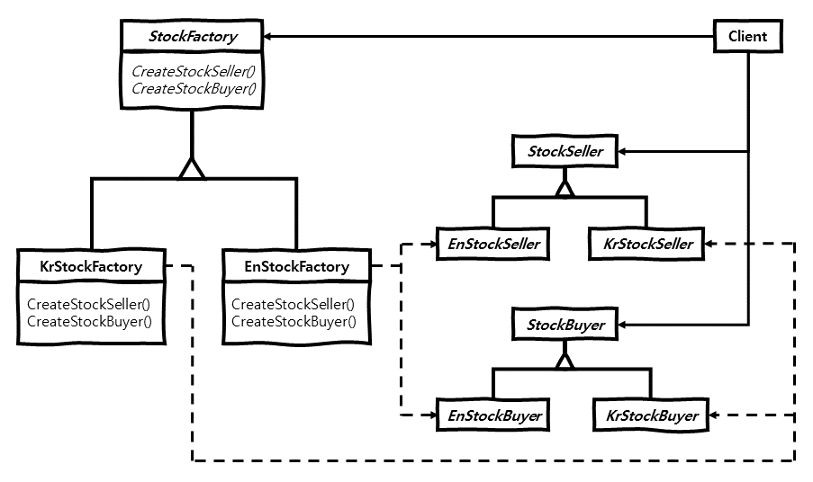

> 본 내용은 **GoF의 디자인 패턴**(Erich Gamma, Richard Helm, Ralph Johnson, John Vlissides 지음, 김정아 옮김)을 읽은 후, 생각을 정리한 내용입니다.  
> 보다 상세한 내용이 궁금하신 분은 해당 책을 읽어보는 것을 추천합니다. 

# 개요
 생성 패턴중 하나인, 추상 팩토리 패턴에 대해 알아봅니다.

# 의도 (Intent)
 다양한 구성요소를 조합하여 일관된 객체(제품군)를 생성하기 위한 인터페이스를 제공합니다.

# 다른 이름 (Also Known As)
 Kit(키트)

# 활용성 (Applicability)
 추상 팩토리는 다음의 경우에 사용합니다.
- 객체 생성 방식에 의존적이지 않은 시스템을 만들 때
- 여러 제품군(다양한 구성요소가 조합된 객체) 중 하나를 선택해 시스템을 구성하고, 향후 다른 제품군으로 대체가 가능해야 할 때
- 연관된 구성요소끼리 함께 조합되어 일관된 제품군으로 사용되도록 강제하고 싶을 때

> 추가로 추상 팩토리를 사용하는 경우로  
> "제품에 대한 클래스 라이브러리를 제공하고, 그들의 구현이 아닌 인터페이스를 노출시키고 싶을 때" 가 있는데,  
> 해당 내용은 올바르게 이해하지 못했습니다.  
> 혹시 위 내용에 대해 이해하신 분은 답글로 알려주시면 감사하겠습니다. :)

# 동기 (Motivation)
 최근 관심이 있어 사이드 프로젝트로 진행하는 [주식 거래 솔루션](https://github.com/luckyDaveKim/WUBU)을 예로 들겠습니다.
주식 거래에 필요한 **구성요소**로는 *시세 조회*, *매수*, *매도* 등이 있으며, 이 구성요소는 다양한 국가에 따라 구현 방법이 
다르다고 가정하겠습니다.

 만약, **한국 주식 거래 솔루션** 사용이 필요할 경우 `KrStockSeller`, `KrStockBuyer` 등의 구성요소를 조합해야 합니다.
그리고 실제 프로젝트에서는 예시로 든 두개의 구성요소가 아닌 무수히 많은 구성요소가 존재할 것이며, 단 하나의 구성요소라도 
잘못 조합할 경우 시스템은 문제를 이르킬 것입니다.  
또한, 기존 **한국 주식 거래 솔루션**이 아닌 **미국 주식 거래 솔루션**으로 대체해야 할 경우 여러 구성요소를 다시 재조합해야 합니다.

 해결 방법으로는 위와 같은 방법 대신 **추상 팩토리**를 사용하여 *한국 주식 팩토리*, *미국 주식 팩토리* 인스턴스를 사용합니다.  
사용자는 `StockFactory`를 사용하며, `StockFactory`를 상속받은 어떤 구체적인 서브 클래스가 어떤 구성요소를 조합하여 결과를 반환하는지 
알 수 없고, 알 필요도 없습니다.  
또한, **한국 주식 거래 솔루션**에서 **미국 주식 거래 솔루션**으로 변경이 필요하면 
단순히 `EnStockFactory`를 할당하여 사용하면 됩니다.

# 구조 (Structure)
 추상 팩토리 패턴의 주요 구조는 다음과 같습니다.

- **StockFactory** 추상 클래스 :  
  `CreateStockSeller()` 메서드는 `StockSeller` 추상 클래스를 반환하고, 
  `CreateStockBuyer()` 메서드는 `StockBuyer` 추상 클래스를 반환합니다.
- **KrStockFactory**, **EnStockFactory** 클래스 :  
  `StockFactory` 추상 클래스를 상속하고, `CreateStockSeller()` 메서드는 
  각각의 알맞는 `KrStockSeller`, `EnStockSeller` 클래스를 생성해서 반환합니다.
- **StockSeller**, **StockBuyer** 추상 클래스 :  
  주식 거래 솔루션에 필요한 다양한 *구성요소*들 이고, 이의 서브 클래스들은 `StockFactory` 추상 클래스의 서브 클래스에서
  알맞게 조합되어 반환됩니다.
- **Client** 클래스 :  
  `StockFactory`, `StockSeller`, `StockBuyer` 등의 추상 클래스만을 통해 제어하며, 어떤 구체적인 서브 클래스가 조합되는지 알 수 
  없고, 알 필요도 없습니다.

# 결과 (Consequences)
 추상 팩토리 패턴을 사용함에 따라 다음과 같은 장/단점이 있습니다.

## 장점
1. **구체적인 클래스를 분리합니다.**  
  추상 팩토리 패턴을 사용하면 응용프로그램이 사용할 클래스를 제어할 수 있습니다.
2. **제품군을 쉽게 대체할 수 있습니다.**  
  구체 팩토리 클래스는 응용프로그램에서 한 번만 나타나기 때문에, 응용 프로그램이 사용할 구체 팩토리를 변경하기 쉽습니다.
3. **구성요소 사이의 일관성을 지킵니다.**  
  연관된 구성요소들이 함께 사용됨을 보장할 수 있습니다.

## 단점
1. **새로운 종류의 구성요소를 추가하기 어렵습니다.**  
  새로운 종류의 구성요소를 추가하기 위해서는 기존의 추상 팩토리와 모든 서브 클래스의 변경이 필요합니다.

# 구현 (Implementation)
추상 팩토리 패턴을 구현하는 방법입니다.

1. **추상 팩토리를 상속하는 하나의 팩토리를 정의합니다.**  
  응용프로그램은 한 제품군에 대해 하나의 팩토리만 있으면 됩니다.  
  `StockFactory` 추상 클래스를 상속하는 `KrStockFactory`를 정의합니다.
2. **구성요소를 생성합니다.**  
  추상 팩토리는 구성요소를 생성하기 위한 *인터페이스*를 선언하는 것이며, 구성요소를 생성하는 책임은 각 구성요소의 추상 클래스를 
  상속하고 있는 구체 클래스들 입니다.  
  `StockSeller` 추상 클래스를 상속하는 `KrStockSeller` 클래스를 생성합니다.
3. **추상 팩토리에 확장 가능한 메서드를 정의합니다.**  
  추상 팩토리에 다양한 구성요소를 생성할 수 있는 메서드를 정의합니다.  
  `StockFactory` 추상 클래스에 `CreateStockSeller()`, `CreateStockBuyer()` 등의 다양한 구성요소를 반환하는 메서드를 정의하고, 
  `KrStockFactory` 클래스에서 알맞은 구성요소를 생성하여 반환하도록 합니다.

# 줄이며...
 다양한 구성요소의 조합을 구체 팩토리 클래스에 위임하여, 손쉽게 구성요소 조합을 사용하고 손쉽게 다른 구성요소 조합으로 변경 할 수 있는
**추상 팩토리 패턴**에 대해 알아보았습니다.
