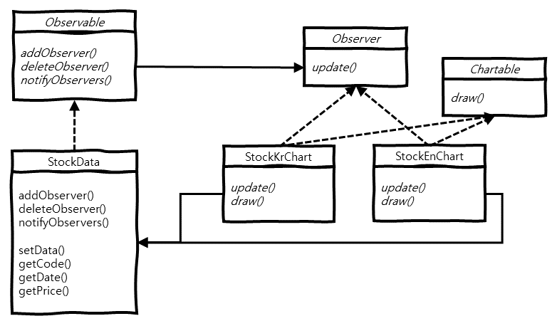

> 본 내용은 **Head First 디자인 패턴**(Eric Freeman, Elisabeth Freeman, Kathy Sierra, Bert Bates 지음, 서환수 옮김)을 읽은 후, 생각을 정리한 내용입니다.  
> 보다 상세한 내용이 궁금하신 분은 해당 책을 읽어보는 것을 추천합니다. 

# 개요
 옵저버 패턴(Observer Pattern)에 대해 알아보고, 구현 방법 및 예시에 대해 알아봅니다.

# 의도 (Intent)
 옵저버 패턴에서는 한 객체의 상태가 바뀌면 그 객체에 의존하는 다른 객체들한테 연락이 가고 자동으로 내용이 갱신되는 방식으로
일대다(One-To-Many) 의존성을 정의합니다.

# 동기 (Motivation)
 주식 데이터는 여러 방법으로 **가공**할 수 있습니다. 동일한 주식 데이터를 기반으로 다양한 *트레이딩 전략*에 따라 가공하거나, 
다양한 종류의 *차트별*로 가공을 할 수 있습니다.  
 또한, 각 가공방법들은 주식 데이터가 갱신되면, 갱신된 데이터를 기반으로 다시 재 가공해야 합니다.  
 일반적인 방법으로는 언제 그리고 어느 시점에 데이터가 가공될지 알기는 쉽지 않습니다. 이럴 때 사용하는 패턴이 **옵저버 패턴**입니다.

 쉬운 예제로 주식 데이터를 기반으로 **한글 차트**, **영문 차트**로 가공하는 예시를 들겠습니다.  
 각 차트에서 1초마다 주식 데이터가 갱신 되었는지 호출 및 데이터를 비교하여, 데이터가 갱신되었을 때 재 가공하는 방법도 있지만, 이 방법은 
비효율 적입니다.  

 해결 방법으로는 **주식 데이터**를 구독 가능한 `Observable` 인터페이스 구현하도록 하고, **한글 차트**, **영문 차트**를 구독자인 
`Observer` 인터페이스를 구현하도록 해서, 주식 데이터가 갱신될 때, 해당 주식 데이터를 구독하는 모든 *구독자*에게 데이터가 갱신됨을 
알려주면 됩니다.  
 여기서 중요한 것은 구독 가능한 **주식 데이터**는 구독자들이 해당 갱신된 데이터를 받아가서 무엇을 하는지 알 수 없고, 알 필요도 없다는 
것 입니다.

# 구조 (Structure)
 옵저버 패턴의 주요 구조는 다음과 같습니다.



- **Observable** 인터페이스 :  
  `addObserver()` 메서드로 `Observer`를 구현한 구독자를 추가할 수 있고,  
  `deleteObserver()` 메서드로 `Observer`를 구현한 구독자를 제거할 수 있고,  
  `notifyObservers()` 메서드로 `Observer`를 구현한 구독자들에게 메시지를 보낼 수 있습니다.
- **StockData** 클래스 :  
  `setData()` 메서드로 데이터를 설정 후, 내부에서 `notifyObservers()` 메서드를 호출해 구독자들에게 메시지를 보내고,  
  `getCode()`, `getDate()`, `getPrice()` 메서드를 통해 커스텀 데이터를 반환합니다.
- **Observer** 인터페이스 :  
  `update()` 메서드를 통해 구독중인 데이터 갱신시 메시지를 처리합니다.
- **Chartable** 인터페이스 :  
  `draw()` 메서드로 차트 그리는 기능을 수행합니다.
- **StockKrChart**, **StockEnChart** 클래스 :  
  `update()` 메서드 내부에서 `draw()` 메서드를 호출해 구독중인 데이터 갱신시 해당 데이터를 기반으로 차트를 그립니다.

# 예제 (Example)
옵저버 패턴의 예제입니다.

```java
public interface Observable {

  void addObserver(Observer observer);

  void deleteObserver(Observer observer);

  void notifyObservers();

}


public class StockData implements Observable {

  private List<Observer> observers;
  private String code;
  private LocalDate date;
  private Long price;

  public StockData() {
    this.observers = new ArrayList<>();
  }

  @Override
  public void addObserver(Observer observer) {
    this.observers.add(observer);
  }

  @Override
  public void deleteObserver(Observer observer) {
    this.observers.remove(observer);
  }

  @Override
  public void notifyObservers() {
    observers.forEach(observer -> observer.update(this));
  }

  public void setData(String code, LocalDate date, Long price) {
    this.code = code;
    this.date = date;
    this.price = price;

    this.notifyObservers();
  }

  public String getCode() {
    return code;
  }

  public LocalDate getDate() {
    return date;
  }

  public Long getPrice() {
    return price;
  }

}
```

 `Observable` 인터페이스를 구현한 `StockData` 클래스를 만듭니다.  
 `StockData` 클래스 내부에는 *구독자* 리스트를 관리할 수 있는 `observers` 맴버 변수를 두고, `addObserver()`, `deleteObserver()`, 
`notifyObservers()` 메서드를 알맞게 구현합니다. 그리고 `setData()` 메서드를 통해 데이터 갱신이 일어나면 `notifyObservers()` 메서드를 
호출하여 모든 구독자들에게 데이터 갱신을 알립니다.

```java
public interface Observer {

  void update(Observable observable);

}


public interface Chartable {

  void draw();

}


public class StockKrChart implements Observer, Chartable {

  private String code;
  private LocalDate date;
  private Long price;

  @Override
  public void update(Observable observable) {
    if (observable instanceof StockData) {
      StockData stockData = (StockData) observable;
      this.code = stockData.getCode();
      this.date = stockData.getDate();
      this.price = stockData.getPrice();

      this.draw();
    }
  }

  @Override
  public void draw() {
    // Chart 그리기
    System.out.printf("코드: %s; 날짜: %s; 가격: %d\n", this.code, this.date, this.price);
  }

}


public class StockEnChart implements Observer, Chartable {

  private String code;
  private LocalDate date;
  private Long price;

  @Override
  public void update(Observable observable) {
    if (observable instanceof StockData) {
      StockData stockData = (StockData) observable;
      this.code = stockData.getCode();
      this.date = stockData.getDate();
      this.price = stockData.getPrice();

      this.draw();
    }
  }

  @Override
  public void draw() {
    // Chart 그리기
    System.out.printf("Code: %s; Date: %s; Price: %d\n", this.code, this.date, this.price);
  }

}
```

 `Observer`, `Chartable` 인터페이스를 구현한 `StockKrChart`, `StockEnChart` 클래스를 만듭니다.  
 `StockKrChart` 클래스는 구독중인 데이터가 갱신되면, 데이터를 한글 기반으로 그리고, 
`StockEnChart` 클래스는 구독중인 데이터가 갱신되면, 데이터를 영문 기반으로 그립니다.

```java
public class Main {

  public static void main(String[] args) {
    StockData stockData = new StockData();

    stockData.addObserver(new StockKrChart());
    stockData.addObserver(new StockEnChart());

    stockData.setData("삼성전자", LocalDate.of(2021, 3, 1), 80000L);
    stockData.setData("삼성전자", LocalDate.of(2021, 3, 2), 90000L);
  }

}
```

 이제 구독 가능한 클래스인 `StockData`를 생성하고, `StockKrChart`, `StockEnChart` 구독자를 추가합니다.  
 이후 삼성전자의 **2021-03-01**, **2021-03-02** 데이터를 입력하면 아래와 같이 *한글 데이터*, *영문 데이터*가 출력됩니다.

```
코드: 삼성; 날짜: 2021-03-01; 가격: 80000
Code: 삼성; Date: 2021-03-01; Price: 80000

코드: 삼성; 날짜: 2021-03-02; 가격: 90000
Code: 삼성; Date: 2021-03-02; Price: 90000
```

# 줄이며...
 구독중인 데이터가 변경될 때, 모든 구독자에게 한번에 알릴 수 있는 **옵저버 패턴**에 대해 알아보았습니다. 하지만 이러한 옵저버 패턴을 
사용할 때 주의할 점이 있습니다. 바로, 옵저버한테 연락이 가는 순서에 의존하면 안된다는 점입니다.  
 즉, 각 옵저버들의 실행 순서는 독립적이여야 한다는 것 입니다.
